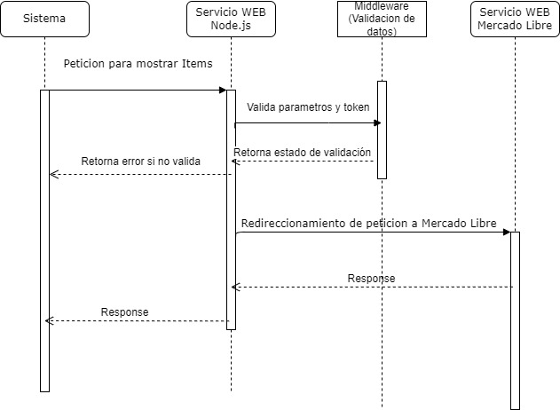

# Instrucciones para ejecutar API

  

  ## Descripcion
  Se crearon 2 apis, para el consumo para un item en particular y para cualquier producto de mercado libre

  ## Apis documentación

  * [Swagger API item particular](http://localhost:4005/api/v1/docs/#/User%20Controller/get_ml_v1_items__id_)
  * [Swagger API Cualquier item](http://localhost:4005/api/v1/docs/#/User%20Controller/get_ml_v1__site_)

  ## Ejecución

  npm run dev

  ## Url API (Ejemplos)

### Api Item Particular
#### URL
* http://localhost:4005/ml/v1/MLM?sort=price_asc&limit=10&offset=10&q=MercadoLibre
#### Curl
* curl -X 'GET' \
  'http://localhost:4005/ml/v1/MLA?offset=10&limit=10&sort=price_asc&q=MercadoLibre' \
  -H 'accept: */*' \
  -H 'x-auth-token: e962f81a-4d42-4eb3-86cd-a25e7237c8dc' \
  -H 'x-auth-token2: 55a4639f-55e8-4e14-a6cc-b79977b20a4e'

### Api Cualquier Item
#### URL
* http://localhost:4005/ml/v1/items/:id
#### Curl
* curl -X 'GET' \
  'http://localhost:4005/ml/v1/items/MLM2576319084' \
  -H 'accept: */*' \
  -H 'x-auth-token: e962f81a-4d42-4eb3-86cd-a25e7237c8dc' \
  -H 'x-auth-token2: 55a4639f-55e8-4e14-a6cc-b79977b20a4e'

## Diagrama de Secuencia
